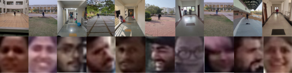

# MobileFaces_dataset
Our research has been accepted at ICPR 2024, where we present the first large-scale face analysis using the newly proposed **MobileFaces** dataset. This dataset consists of images and videos captured in real-world, unconstrained environments, encompassing a wide range of distances, poses, and resolutions, all recorded using mobile phones.

#### Dataset Details

| **Attribute**               | **Details**                                         |
|-----------------------------|-----------------------------------------------------|
| **Number of Subjects**      | 87                                                  |
| **Number of Frames per Video** | 200-250                                            |
| **Number of Videos**        | 261 (87 videos per distance)                       |
| **Total Number of Frames**  | 52,913                                              |
| **Frame Dimensions**        | 1920 × 1080 pixels                                 |
| **Frame Rate**              | 30.01 frames/second                                |
| **Gallery Views**           | 5 views per subject (Front, 30° Left, 30° Right, 45° Left, 45° Right) |
| **Age Range**               | 18-34 years, Average 22.6 years                    |
| **Gender Ratio**            | 50 Boys, 37 Girls                                  |
| **Distances from Mobile**   | 2, 5, and 10 meters                                |
| **Location**                | Indoor, Outdoor daytime (Natural light), Outdoor nighttime (Synthetic light) |
| **Annotation**              | Age and gender of each subject in a CSV file       |

#### Sample Images

The figure below displays sample images from our dataset, including both full images and cropped face images captured at a distance of 10 meters. These images illustrate the challenges encountered in unconstrained environments with subjects free to do natural actions.

## MobileFace.zip

The zip file contains datasets for both face verification and face attribute analysis tasks. Additionally it include a ground truth CSV file for the face attribute analysis task.   
- The dataset is organized into three folders, corresponding to three different distances: 2 meters, 5 meters, and 10 meters.
- Each distance folder contains 87 subfolders, representing the total number of subjects. Each subfolder contains the detected probe face images of the subject at the specified distance.
- For face verification, 1,914 probe images were used at each distance.
- For face attribute analysis, 1,305 images were used at each distance.

#### Face_verification/Face_Attribute:

- **2M:** 
  - `Subject_ID:`
    - `image_num`
    - `image_num`
    - ...

- **5M:** 
  - `Subject_ID:`
    - `image_num`
    - `image_num`
    - ...

- **10M:** 
  - `Subject_ID:`
    - `image_num`
    - `image_num`
    - ...

#### GT_Age_Gender.csv
This file contains ground truth values for the face attribute analysis task. The CSV file has three columns: `Subject ID`, `Age`, and `Gender`.
- **Subject ID:** Contains 87 rows, corresponding to the 87 subjects.
- **Age:** Contains the true age of each subject.
- **Gender:** Contains the gender of each subject, with values either "Man" or "Woman".

## Cropped_Front_Face.zip

The zip file contains a folder with 87 gallery images for the face verification task. These are cropped front face images, with the name of images corresponding to the Subject ID.

## License Agreement
- Please sign and send the license agreement to the  [akagarwal@iiserb.ac.in](mailto:akagarwal@iiserb.ac.in) to receive the password for the zip files.
- If you have any questions about this dataset, please contact at [akagarwal@iiserb.ac.in](mailto:akagarwal@iiserb.ac.in) or [udayrathore748@gmail.com](mailto:udayrathore748@gmail.com).

## Citation:
- Udaybhan Rathore, Akshay Agarwal, “An Unconstrained Dataset for Face Recognition Across Distance, Pose, and Resolution”. In IEEE International Conference on Pattern Recognition (ICPR), 2024.

